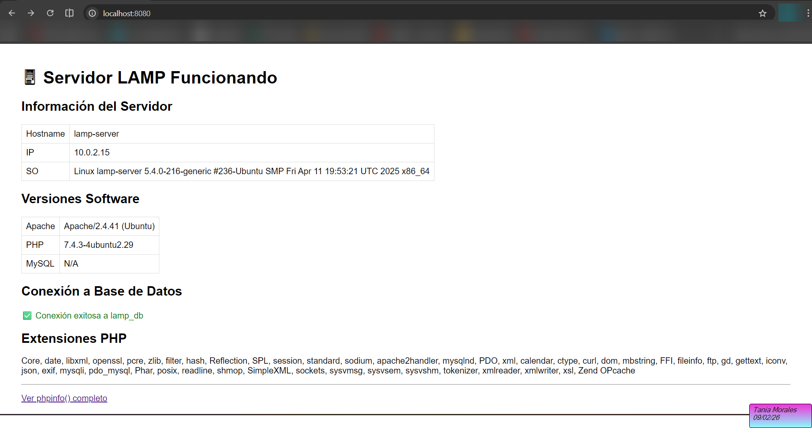
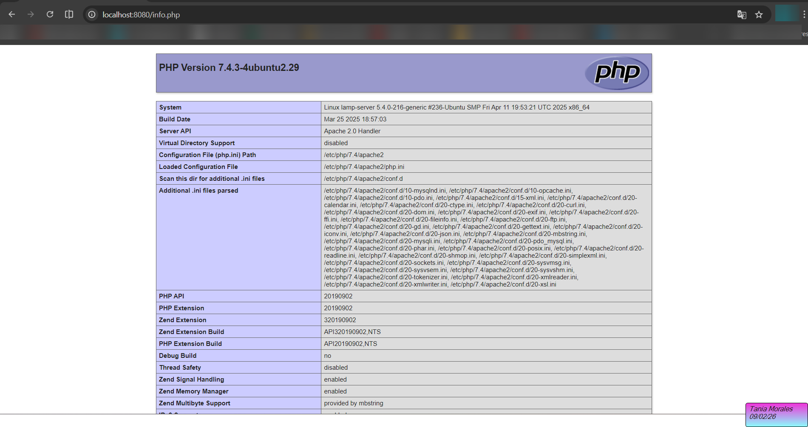

# Servidor LAMP Automatizado con Vagrant

Este proyecto implementa un servidor **LAMP** (Linux, Apache, MySQL y PHP) completamente automatizado mediante **Vagrant** y **VirtualBox**.  
El objetivo es desplegar una máquina virtual Ubuntu que configure automáticamente:

- Apache 2.4  
- MySQL 8.0 con base de datos y usuario creados  
- PHP 7.4+ con extensiones necesarias  
- Virtual host personalizado  
- Aplicación web PHP funcional  
- Scripts de provisioning separados y un script maestro  

El entorno se levanta con un solo comando: **`vagrant up`**.

---

## 🏗️ Arquitectura del sistema


PE01-LAMP/
├── Vagrantfile
├── README.md
├── scripts/
│   ├── provision.sh
│   ├── install-apache.sh
│   ├── install-mysql.sh
│   └── install-php.sh
└── www/
    ├── index.php
    └── info.php


---

## 📦 Tecnologías utilizadas

|   Componente   |  Versión  |         Descripción        |
|----------------|-----------|----------------------------|
| **Ubuntu**     | 20.04 LTS | Sistema operativo base     |
| **Apache**     | 2.4       | Servidor web               |
| **MySQL**      | 8.0       | Motor de base de datos     |
| **PHP**        | 7.4+      | Lenguaje backend           |
| **Vagrant**    | 2.4+      | Automatización de entornos |
| **VirtualBox** | 7.0+      | Hipervisor                 |

---

## 🧰 Requisitos previos

- VirtualBox 7.0 o superior  
- Vagrant 2.4 o superior  
- PowerShell (Windows)  
- 2 GB de RAM libres  
- 5 GB de espacio en disco  

---

## 🚀 Instalación y despliegue

Clona el repositorio y levanta la máquina:

```bash
git clone https://github.com/taniamoralessanchez/PE01-LAMP
cd PE01-LAMP
vagrant up

## 🚀 Accede al servidor

Una vez ejecutado `vagrant up`, puedes acceder a los distintos servicios del entorno LAMP:

|              Servicio             |     URL / Comando     |
|-----------------------------------|-----------------------|
| **Sitio web (puerto redirigido)** | http://localhost:8080 |
| **IP privada de la VM**           | http://192.168.56.100 |
| **Acceso SSH**                    | `vagrant ssh`         |

### Comandos útiles

Reiniciar la máquina:
vagrant reload

Apagar la máquina:
vagrant halt

Destruir y recrear desde 0:
vagrant destroy -f
vagrant up

## 🗄️ Base de datos

Durante el provisioning se crea automáticamente la base de datos y el usuario necesarios para la aplicación.

### Credenciales MySQL

|      Parámetro    |    Valor   |
|-------------------|------------|
| **Base de datos** |  `lamp_db` |
|    **Usuario**    |`lamp_user` |
|  **Contraseña**   | `lamp_pass`|
|      **Host**     | `localhost`|

### Probar la conexión desde la VM

vagrant ssh -c "mysql -u lamp_user -plamp_pass lamp_db -e 'SELECT 1;'"

## 📸 Capturas de pantalla

A continuación se muestran las capturas que verifican el correcto funcionamiento del entorno LAMP.

### 🖥️ 1. Página principal funcionando
Esta captura muestra que Apache sirve correctamente el archivo `index.php`.



---

### 🧩 2. Información completa de PHP (phpinfo)
Demuestra que PHP está instalado, cargado en Apache y con las extensiones requeridas.



---

